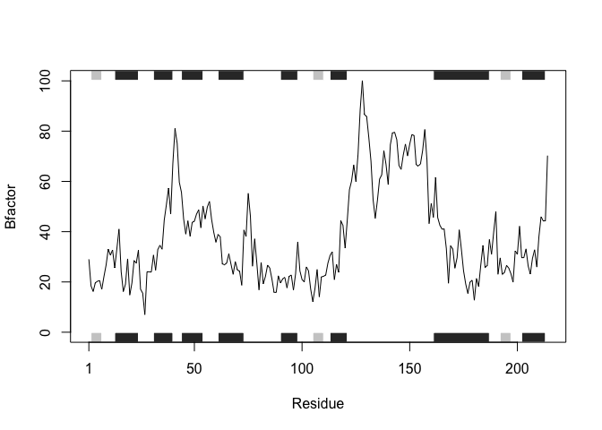
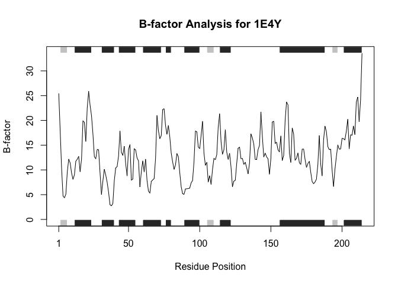

# Class 6 function homework
Tonhi (A18508020)

## Improving provided code

``` r
# Can you improve this analysis code?
library(bio3d)
s1 <- read.pdb("4AKE") # kinase with drug
```

      Note: Accessing on-line PDB file

``` r
s2 <- read.pdb("1AKE") # kinase no drug
```

      Note: Accessing on-line PDB file
       PDB has ALT records, taking A only, rm.alt=TRUE

``` r
s3 <- read.pdb("1E4Y") # kinase with drug
```

      Note: Accessing on-line PDB file

``` r
# This function accesses the online PDB database and retrieve the specified protein using its four-character identifier input. The output of the function is an object containing atomic, structural, and metadata information for the specified protein structure.

s1.chainA <- trim.pdb(s1, chain="A", elety="CA")
s2.chainA <- trim.pdb(s2, chain="A", elety="CA")
s3.chainA <- trim.pdb(s1, chain="A", elety="CA")
# The function takes a 4-letter PDB identifier, a specific protein chain ID (e.g., "A"), and an atom type (e.g., "CA") to filter the structural data. It keep only the selected chain and CA atoms for focused analysis. It outputs a trimmed PDB object that can be used for downstream analyses such as extracting and plotting B-factors.

s1.b <- s1.chainA$atom$b
s2.b <- s2.chainA$atom$b
s3.b <- s3.chainA$atom$b
# The input is a trimmed PDB object (e.g., s1.chainA) that contains atom information from a protein structure. This code extracts the B-factor values from the atom$b component of the PDB object and stores them as a numeric vector. The output is a numeric vector of B-factors.

plotb3(s1.b, sse=s1.chainA, typ="l", ylab="Bfactor")
```



``` r
plotb3(s2.b, sse=s2.chainA, typ="l", ylab="Bfactor")
```


``` r
plotb3(s3.b, sse=s3.chainA, typ="l", ylab="Bfactor")
```


``` r
#The code takes a numeric vector of B-factors and the corresponding trimmed PDB object to provide secondary structure information. It generates a line plot of B-factors vs. residue position and overlays secondary structure elements to aid interpretation. The output is a graphical plot displaying protein flexibility (B-factors) across residues.
```

## Write a function from the supplied code

``` r
library(bio3d)

# Function to analyze protein drug interactions using B-factors
analyze_protein_drug_interaction <- function(pdb_id, chain = "A", elety = "CA") {
  
  # Read protein structure
  pdb <- read.pdb(pdb_id)
  
  # Trim structure to selected chain and atom type
  pdb_chain <- trim.pdb(pdb, chain = chain, elety = elety)
  
  # Extract B-factors
  b_factors <- pdb_chain$atom$b
  
  # Plot B-factors with secondary structure annotation
  plotb3(
    b_factors,
    sse  = pdb_chain,
    typ  = "l",
    ylab = "B-factor",
    xlab = "Residue Position",
    main = paste("B-factor Analysis for", pdb_id)
  )
}
```

Example:

``` r
analyze_protein_drug_interaction("1E4Y")
```

      Note: Accessing on-line PDB file

    Warning in get.pdb(file, path = tempdir(), verbose = FALSE):
    /var/folders/n0/stsdw7gn6q36btb46nvvr8hr0000gn/T//Rtmp5pUJvj/1E4Y.pdb exists.
    Skipping download


