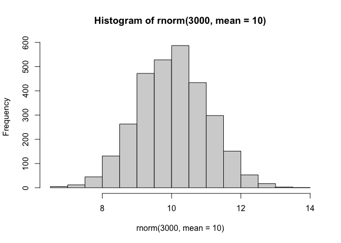
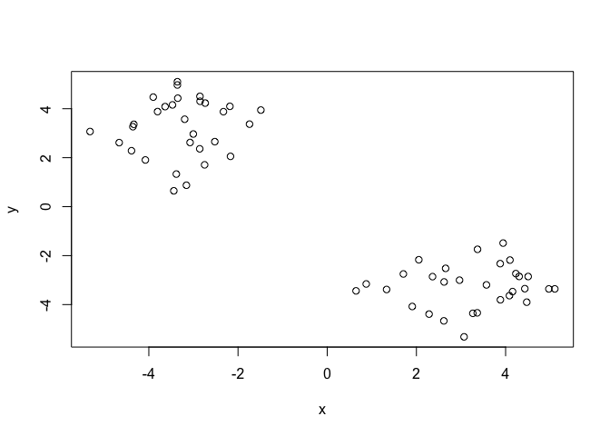
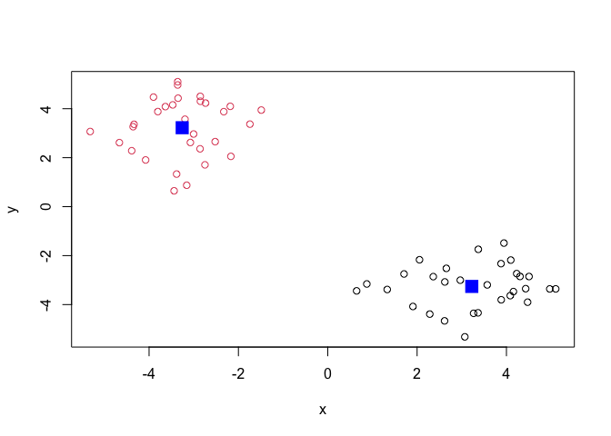
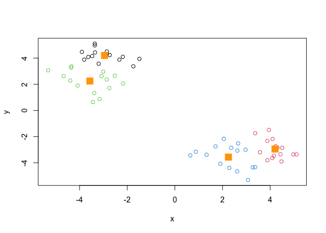
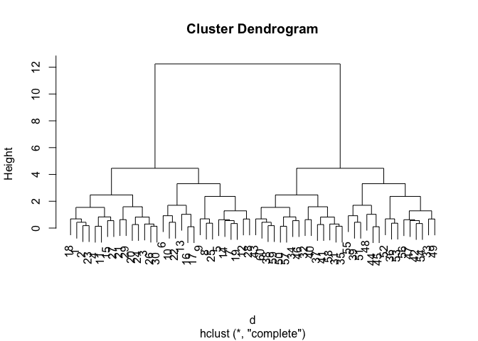
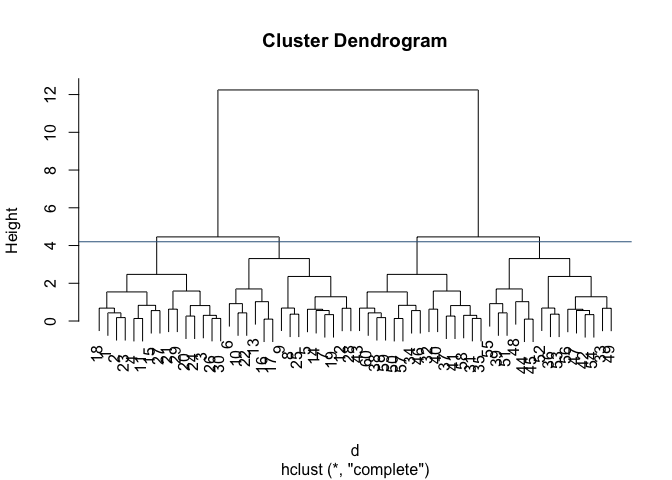
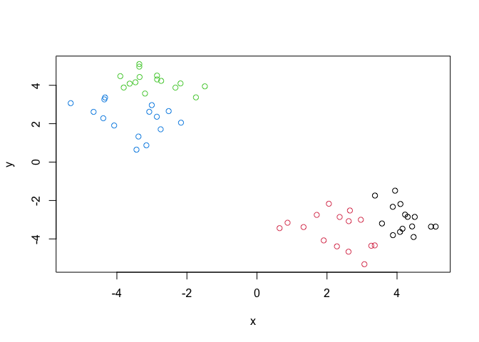
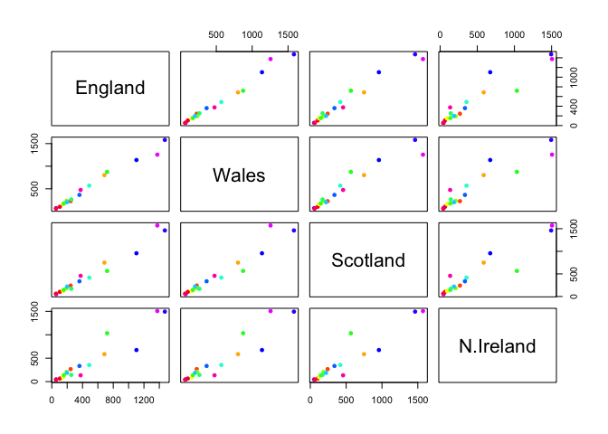
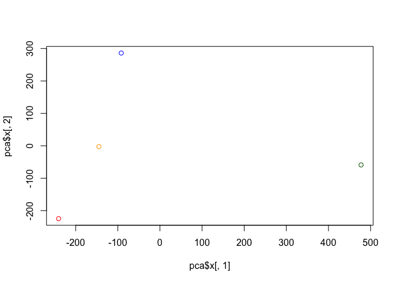

# Class 7: Machine Learning I
Tonhi Dinh (A18508020)

- [Quarto](#quarto)
- [K-means clustering](#k-means-clustering)
- [Hierarchical clustering](#hierarchical-clustering)
- [Principle Component Analysis
  (PCA)](#principle-component-analysis-pca)
  - [PCA for UK food data](#pca-for-uk-food-data)
- [PCD the rescue](#pcd-the-rescue)
- [Digging deeper (variable loading)](#digging-deeper-variable-loading)

## Quarto

Today we will begin our exploration of important machine learning
methods with a focus on **clustering** and **dimensionality reduction**.

To start testing these methods, let’s make up some sample data to
cluster where we know what the answer should be.

``` r
hist(rnorm(3000, mean=10))
```



> Q. Can you generate 30 numbers centered at +3 and 30 numbers at -3
> taken at random from a normal distribution?

``` r
tmp <- c(rnorm(30, mean=3),
         rnorm(30, mean=-3))
x <-cbind(x=tmp, y=rev(tmp))
plot(x)
```



## K-means clustering

The main function in “base R”for K-means clustering is called
`kmeans()`, let’s try it out:

``` r
k <- kmeans(x, center = 2)
k
```

    K-means clustering with 2 clusters of sizes 30, 30

    Cluster means:
              x         y
    1  3.224100 -3.258602
    2 -3.258602  3.224100

    Clustering vector:
     [1] 1 1 1 1 1 1 1 1 1 1 1 1 1 1 1 1 1 1 1 1 1 1 1 1 1 1 1 1 1 1 2 2 2 2 2 2 2 2
    [39] 2 2 2 2 2 2 2 2 2 2 2 2 2 2 2 2 2 2 2 2 2 2

    Within cluster sum of squares by cluster:
    [1] 63.10175 63.10175
     (between_SS / total_SS =  90.9 %)

    Available components:

    [1] "cluster"      "centers"      "totss"        "withinss"     "tot.withinss"
    [6] "betweenss"    "size"         "iter"         "ifault"      

> Q. What component of your kmeans result object has the cluster
> centers?

``` r
k$centers
```

              x         y
    1  3.224100 -3.258602
    2 -3.258602  3.224100

> Q. What component of yoru kmeans result object has the cluster size
> (i.e. how many points are in each cluster)?

``` r
k$size
```

    [1] 30 30

> Q. What component of your kmeans result object has the cluster
> membership vector (i.e. the main clustering result: which points are
> in which cluster)?

``` r
k$cluster
```

     [1] 1 1 1 1 1 1 1 1 1 1 1 1 1 1 1 1 1 1 1 1 1 1 1 1 1 1 1 1 1 1 2 2 2 2 2 2 2 2
    [39] 2 2 2 2 2 2 2 2 2 2 2 2 2 2 2 2 2 2 2 2 2 2

> Q. Plot the results of clustering (i.e. our data colored by the
> clustering results) along with the cluster results?

``` r
plot(x,col=k$cluster)
points(k$centers, col="blue", pch=15,cex=2)
```



> Q. Can you run `kmeans()` again and cluster `x` into 4 clusters and
> plot the results just like we did above with coloring by cluster and
> the cluster centers shown in blue?

``` r
k4 <- kmeans(x, centers=4)
plot(x, col=k4$cluster)
points(k4
       $centers, col="orange", pch = 15, cex = 2)
```



> **Key points:** Kmeans will alaways reutrn the clustering that we ask
> for (this is the “K” or “centers” in K-means)

``` r
k$tot.withinss
```

    [1] 126.2035

## Hierarchical clustering

The main function for Hierarchical clustering in base R is called
`hclust()`. One of the main differences with respect to the `kmeans()`
function is that you cannot just pass you input data directly from
`hclust()` - it needs a “distance matrix” as input. We can get this from
lots of places including the `dist()` function.

``` r
d <- dist(x)
hc <- hclust(d)
plot(hc)
```



We can cut the dendogram or “tree” at a given height to yield our
“clusters”. For this we use the function `cutree()`

``` r
plot(hc)
abline(h=4.2, col="steelblue4")
```



``` r
grps <- cutree(hc, h=4.2)
```

``` r
grps
```

     [1] 1 1 1 1 2 2 2 2 2 2 1 2 2 2 1 2 2 1 2 1 1 2 1 1 2 1 1 2 1 1 3 3 4 3 3 4 3 3
    [39] 4 3 3 4 3 4 4 3 4 4 4 3 4 4 4 4 4 4 3 3 3 3

> Q. Plot our data `x` colored by the clustering result from
> `hclust()`and `cutree()`?

``` r
grps <- cutree(hc, h=4.2)
plot(x, col=grps)
```



## Principle Component Analysis (PCA)

PCA is a popular dimensionality reduction technique that is widely used
in Bioinformatics.

### PCA for UK food data

Start the lab sheet…

``` r
url <- "https://tinyurl.com/UK-foods"
x <- read.csv(url)
```

It looks like the row names are not set properly. We can fix this:

``` r
rownames(x) <- x[,1]
x <- x[,-1]
```

A better way to do this is fix the row names assignment at import time:

``` r
x <- read.csv(url, row.name = 1)
```

> Q1. How many rows and columns are in your new data frame named x? What
> R functions could you use to answer this questions?

``` r
dim(x)
```

    [1] 17  4

> Q2. Which approach to solving the ‘row-names problem’ mentioned above
> do you prefer and why? Is one approach more robust than another under
> certain circumstances?

``` r
#x <- x[,-1] # I prefer this one because it's simpler and involved less typing. However, if I keep running it, it will delete more rows4
```

> Q3: Changing what optional argument in the above barplot() function
> results in the following plot?

``` r
barplot(as.matrix(x), beside=T, col=rainbow(nrow(x)))
```


``` r
barplot(as.matrix(x), beside=T, col=rainbow(nrow(x))) # changing beside=T to beside=F
```

> Q5: We can use the pairs() function to generate all pairwise plots for
> our countries. Can you make sense of the following code and resulting
> figure? What does it mean if a given point lies on the diagonal for a
> given plot?

``` r
pairs(x, col=rainbow(nrow(x)), pch=16) # If the countries have the same consumption level, it would have the same point. The points also indicate how much each country consumes each type of food relative for each other.
```



``` r
library(pheatmap)
pheatmap( as.matrix(x) )
```


Of all these plot really only the `pairs()` plot was useful. This
however took a bit of work to interpret and will not scale when I am
looking at much bigger datasets.

## PCD the rescue

The main function in “base R” for PCA is called `prcomp()`.

``` r
pca <- prcomp(t(x))
summary(pca)
```

    Importance of components:
                                PC1      PC2      PC3       PC4
    Standard deviation     324.1502 212.7478 73.87622 3.176e-14
    Proportion of Variance   0.6744   0.2905  0.03503 0.000e+00
    Cumulative Proportion    0.6744   0.9650  1.00000 1.000e+00

> Q. How much variance is captured in the first PC?

67.4%

> Q. How many PCs do I need to capture at least 90% of the titak
> variance in the data set?

Two PCs captured 96.5%

> Q. Plot our main PCA results. FOlks can call this different things
> depending on their field of study e.g. “PC plot”, “orientation plot”,
> “score plot”, “PC1 vs PC2 plot”.

To generate out PCA score plot we want the pca\$x component of the
result object

``` r
pca$x
```

                     PC1         PC2        PC3           PC4
    England   -144.99315   -2.532999 105.768945 -4.894696e-14
    Wales     -240.52915 -224.646925 -56.475555  5.700024e-13
    Scotland   -91.86934  286.081786 -44.415495 -7.460785e-13
    N.Ireland  477.39164  -58.901862  -4.877895  2.321303e-13

``` r
my_cols <- c("orange", "red", "blue", "darkgreen")
plot(pca$x[,1], pca$x[,2], col=my_cols)
```



``` r
library(ggplot2)

pca$x
```

                     PC1         PC2        PC3           PC4
    England   -144.99315   -2.532999 105.768945 -4.894696e-14
    Wales     -240.52915 -224.646925 -56.475555  5.700024e-13
    Scotland   -91.86934  286.081786 -44.415495 -7.460785e-13
    N.Ireland  477.39164  -58.901862  -4.877895  2.321303e-13

``` r
ggplot(pca$x) + 
  aes(PC1, PC2) + 
  geom_point(col = my_cols)
```


## Digging deeper (variable loading)

How do the original variables (i.e. the 17 different foods) contribute
to our new PCs?

``` r
ggplot(pca$rotation) +
  aes(x = PC1, 
      y = reorder(rownames(pca$rotation), PC1)) +
  geom_col(fill = "steelblue") +
  xlab("PC1 Loading Score") +
  ylab("") +
  theme_bw() +
  theme(axis.text.y = element_text(size = 9))
```


