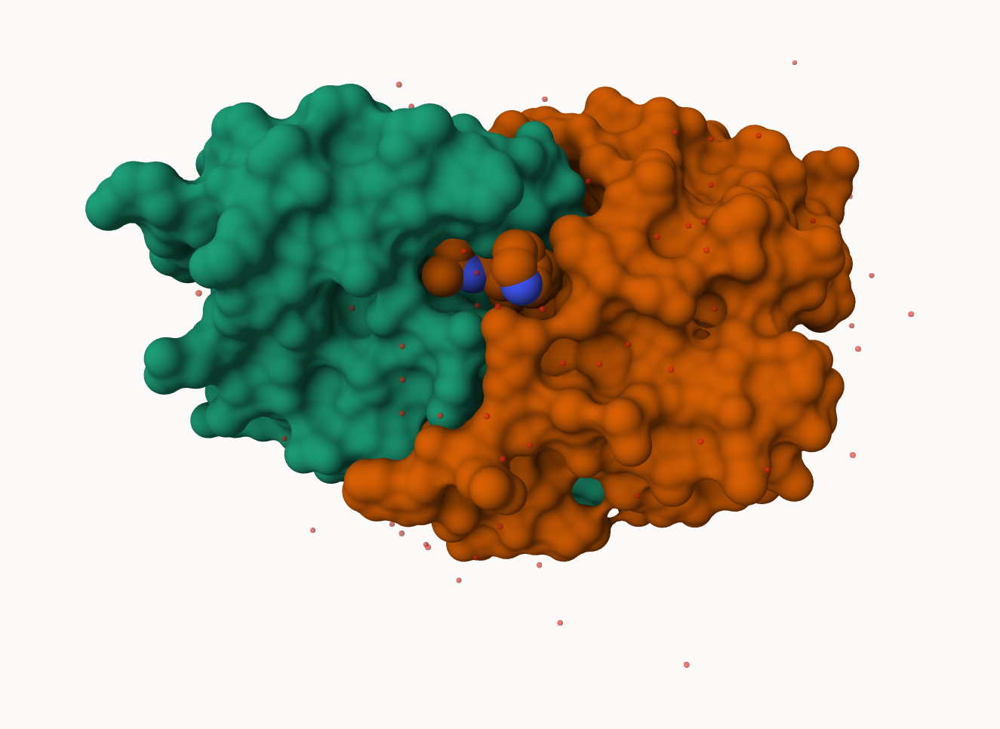

## PDB Statistics

The Protein Data Bank (PDB) is the main repository of biomolecular structures. Let's see what it contains:

```{r}
stats <- read.csv("Data Export Summary.csv")
stats
```

```{r}
sum(stats$Neutron)
```

The commna in these numbers leads to the numbers here being read as characters
```{r}
c(100, "Barry")
```

```{r}
library(readr)
stats <- read_csv("Data Export Summary.csv")
stats
```

```{r}
n.xray <- sum(stats$`X-ray`)
#n.em <- 
n.total <- sum(stats$Total)

n.xray/n.total
```

> Q1: What percentage of structures in the PDB are solved by X-Ray and Electron Microscopy.

```{r}
n.xray <- sum(stats$`X-ray`)
n.em <- sum(stats$EM)
n.total <- sum(stats$Total)

(n.xray/n.total) * 100
(n.em/n.total) * 100
```

> Q2: What proportion of structures in the PDB are protein?

```{r}
n.protein <- sum(stats$Total[grep("Protein", stats$`Molecular Type`)])
(n.protein / n.total) * 100
```
> Q3. Q3: Type HIV in the PDB website search box on the home page and determine how many HIV-1 protease structures are in the current PDB?

Skip...

## Visualizing the HIV-1 protease structure

We can use Molstar viewer online: https://molstar.org/viewer/


A clean image showing the catalytic ASP25 amino acids in both chains of the HIV-PR dimer along with the inhibitor and all important active site water


## Bio3D package for structural bioinformatics

```{r}
library(bio3d)

pdb <- read.pdb("1hsg")
pdb
```

```{r}
head( pdb$atom )
```

```{r}
library(bio3dview)

# view.pdb(pdb)
```
```{r}
# Select the important ASP 25 residue
sele <- atom.select(pdb, resno=25)

# and highlight them in spacefill representation
# view.pdb(pdb, cols=c("steelblue","lightpink"), 
       #  highlight = sele,
        # highlight.style = "spacefill") 
```

## Predicting functional motions of a single structure

Read an ADK structure from the PDB database:
```{r}
adk <- read.pdb("6s36")
adk
```

```{r}
m <- nma(adk)
plot(m)
```

Write out our results as a wee trajectory/movie of predicted motions:

```{r}
mktrj(m, file="adk_m7.pdb")
```


## Comparative Analysis with PCA

First step: Find an ADK sequence:

```{r}
library(bio3d)
id <- "1ake_A" ## Change this to run a different analysis
aa <- get.seq("1ake_A")
```
Next step, is search the PDB dtata base fore all related entries:
```{r}
blast <- blast.pdb(aa)
hits <- plot(blast)
```

```{r}
blast$hit.tbl
```

The "top hits" are in the `hits` obejct. now we can download these to our computer.Put these in a wee sub-folder (diretory) called "pdbs" and use gzip to speed things up

```{r}
#Download related PDB files
files <- get.pdb(hits$pdb.id, path = "pdbs", split = TRUE, gzip = TRUE)
```

These look like a hot mess.


Next we will use the `pdbaln()` function to align and also optionally fit (i.e. superpose) the identified PDB structures.

This require a BioConductor package called "msa" that we need to install. First we install BiocManager.Then we use `BiocManager::install("msa")`

```{r}
# Align releated PDBs
pdbs <- pdbaln(files, fit = TRUE, exefile="msa")

```

Have a wee peak at this new "alignment object" `pdbs`
```{r}
pdbs
```

We could view these i R with **bio3dview** `view.pdbs()` function

```{r}
# library(bio3dview)

# view.pdbs(pdbs, colorScheme = "residue")
```


## PCA

We can ru PCA on our `pdbs` object using the `pca()` function from **bio3d**:

```{r}
pc.xray <- pca(pdbs)
plot(pc.xray)
```

```{r}
plot(pc.xray, 1:2)
```

We can a visualization of the major conformational difference (i.e. large scale structure change) captured by our PCA analysis with the `mktrj()` function.

```{r}
pc1 <- mktrj(pc.xray, file="pca.pdb")
```

Let's see in Mol-star:


