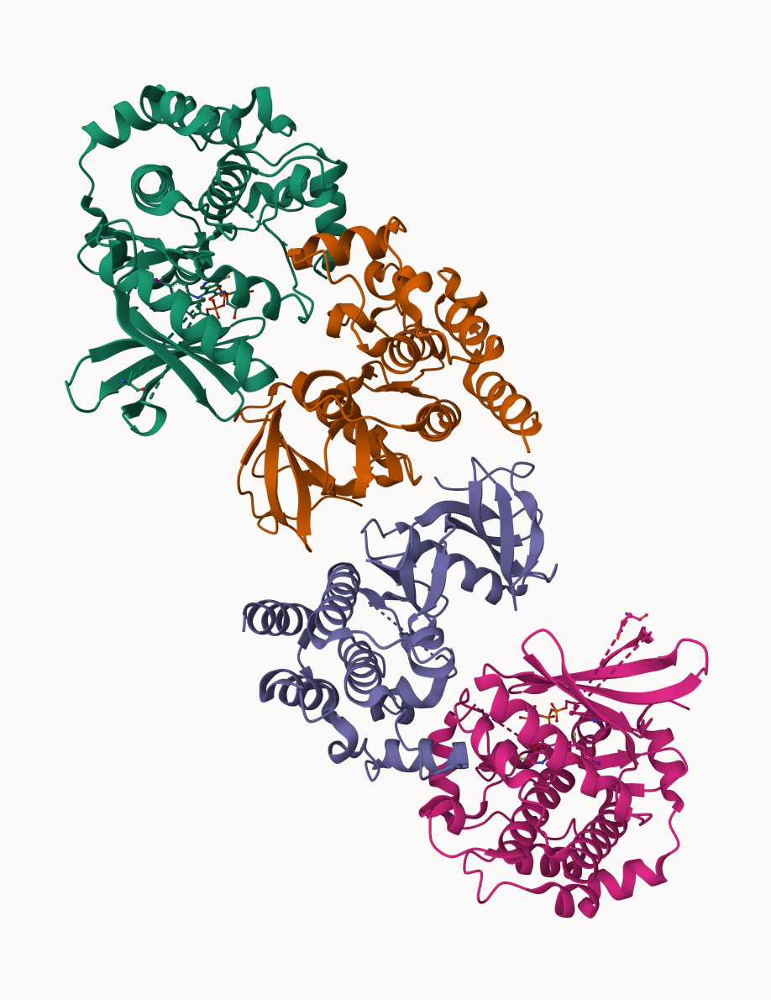

I downloaded my sequence from the class website and moved it to my working directory:

From a **BLASTp** searach against human refseq I see that it is:

> Q1. [1pt] What protein do these sequences correspond to? (Give both full gene/protein name and official symbol).

- Official symbol: BRAF
- Official name: B-Raf proto-oncogene, serine/threonine kinase

```{r}
library(bio3d)

seq <- read.fasta("./Class 19/A18508020_mutant_seq.fa")
seq
```

We could score residue conservation and then find the non 1.0 scoring position. These will be the mutation positions:

```{r}
conserv(seq)
```

```{r}
mutation.sites <- which(conserv(seq) < 1)
```

> Q2. [6pts] What are the tumor specific mutations in this particular case ( e.g. A130V)?

```{r}
paste(seq$ali[1, mutation.sites],
mutation.sites,
seq$ali[2, mutation.sites])
```

> Q3. [1pts] Do your mutations cluster to any particular domain and if so give the name and PFAM id of this domain? Alternately note whether your protein is single domain and provide it’s PFAM id/accession and name (e.g. PF00613 and PI3Ka).

Domains from hmmer search


PFAM:

Description:

Coordinates: 
- K578V: Transferase(Phosphotransferase) domain 1
- K591E: Transferase(Phosphotransferase) domain 1
- M620R: Transferase(Phosphotransferase) domain 1
- I666Y: Transferase(Phosphotransferase) domain 1

> Q4. [2pts] Using the NCI-GDC list the observed top 2 missense mutations in this protein
(amino acid substitutions)?

V640E - chr7:g.140753336A>T
V640M - chr7:g.140753337C>T

> Q5. [2pts] What two TCGA projects have the most cases affected by mutations of this gene? (Give the TCGA “code” and “Project Name” for example “TCGA-BRCA” and “Breast Invasive Carcinoma”).

TCGA-THCA - Thyroid Carcinoma
TCGA-SKCM - Skin Cutaneous Melanoma

> Q6. [3pts] List one RCSB PDB identifier with 100% identity to the wt_healthy sequence and detail the percent coverage of your query sequence for this known structure? Alternately, provide the most similar in sequence PDB structure along with it’s percent identity, coverage and E-value. Does this structure “cover” (i.e. include or span the amino acid residue positions) of your previously identified tumor specific mutations?

Chain B, Serine/threonine-protein kinase B-raf [Homo sapiens]

- Query coverage: 39%

- Percent identity: 100.00%

- E-value: 0.0




> Q7. [10pts] Using AlphaFold notebook generate a structural model using the default parameters for your mutant sequence.


> Q8. [2pts] Considering only your mutations in high quality structure regions (with a pLDDT score > 70) are any of the mutations on the surface of the protein and hence have a potential to interfere with protein-protein interaction events? List these mutations below (e.g. A130V)


> Q9. [5pts] Please comment on how useful and/or reliable you think your AlphaFold structural model is for your entire sequence and the main domain where your mutations lie? You may wish to compare your model to the PDB structure you found in Q6.


> Q10. [10pts] Are any of the identified “hot spots” near your cancer specific mutation sites or the most commonly mutated sites from the NCI-GDC? If so which mutation site(s)?


