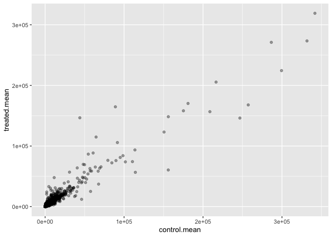
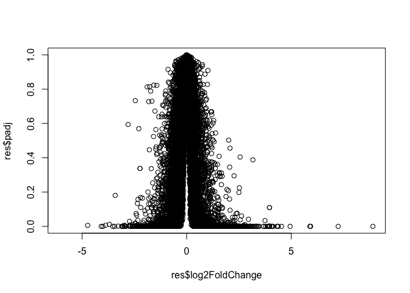
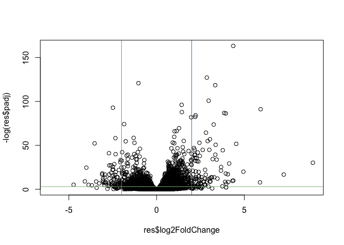
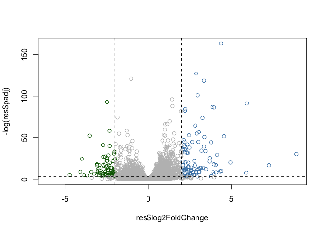
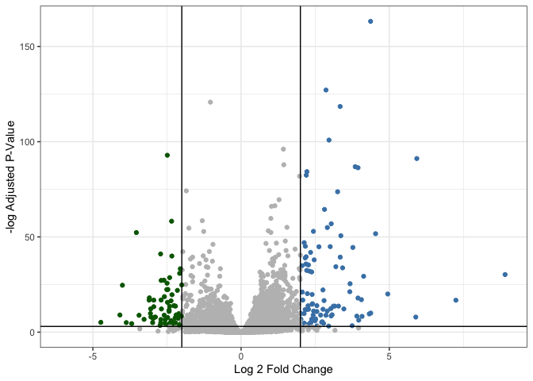

# Class 13: RNA Seq with DESeq2
Tonhi Dinh (A18508020)

- [Background](#background)
- [Data Import](#data-import)
- [Differential gene expression](#differential-gene-expression)
- [DESeq Analysis](#deseq-analysis)
  - [Run the DESeg analysis pipeline](#run-the-deseg-analysis-pipeline)
- [Volcano Plot](#volcano-plot)
- [Save our results](#save-our-results)
- [Add annotation data](#add-annotation-data)
- [Save annotated results to a CSV
  file](#save-annotated-results-to-a-csv-file)
- [Pathway analysis](#pathway-analysis)

## Background

Today we will perform an RNASeq analysis of the effects of a common
sertoid on airway cells.

In particular, dexamethasone (hereafter just called “dex”) on different
airway smooth muscle cell lines (ASM cells).

## Data Import

We need two different inputs:

- **countData**: with genes in row and experiments in columns
- **colData**: meta data that describes the column in countData

``` r
counts <- read.csv("airway_scaledcounts.csv", row.names = 1)
metadata <- read.csv("airway_metadata.csv")
```

A wee peak at counts and meta data

``` r
head(counts)
```

                    SRR1039508 SRR1039509 SRR1039512 SRR1039513 SRR1039516
    ENSG00000000003        723        486        904        445       1170
    ENSG00000000005          0          0          0          0          0
    ENSG00000000419        467        523        616        371        582
    ENSG00000000457        347        258        364        237        318
    ENSG00000000460         96         81         73         66        118
    ENSG00000000938          0          0          1          0          2
                    SRR1039517 SRR1039520 SRR1039521
    ENSG00000000003       1097        806        604
    ENSG00000000005          0          0          0
    ENSG00000000419        781        417        509
    ENSG00000000457        447        330        324
    ENSG00000000460         94        102         74
    ENSG00000000938          0          0          0

``` r
metadata
```

              id     dex celltype     geo_id
    1 SRR1039508 control   N61311 GSM1275862
    2 SRR1039509 treated   N61311 GSM1275863
    3 SRR1039512 control  N052611 GSM1275866
    4 SRR1039513 treated  N052611 GSM1275867
    5 SRR1039516 control  N080611 GSM1275870
    6 SRR1039517 treated  N080611 GSM1275871
    7 SRR1039520 control  N061011 GSM1275874
    8 SRR1039521 treated  N061011 GSM1275875

> Q1. How many genes are in this dataset?

``` r
nrow(counts)
```

    [1] 38694

> Q2. How many ‘control’ cell lines do we have?

``` r
sum(metadata$dex == "control") 
```

    [1] 4

``` r
table(metadata$dex)
```


    control treated 
          4       4 

## Differential gene expression

We have four replicate drug treated and control (no drug)
columns/experiments in our `counts` object

We want one “mean” value for each gene (rows) in “treated” (drug) and
one mean value for each gene in “control” columns.

Step 1: Find all “control” columns in `counts` Step 2: Extract these
columns to a new object called `control.counts` Step 3: Then calculate
the mean value for each gene

Step 1

``` r
control.inds <- metadata$dex == "control"
```

Step 2

``` r
control.counts <- counts[, control.inds]
```

Step 3

``` r
control.mean <- rowMeans(control.counts)
head(control.mean)
```

    ENSG00000000003 ENSG00000000005 ENSG00000000419 ENSG00000000457 ENSG00000000460 
             900.75            0.00          520.50          339.75           97.25 
    ENSG00000000938 
               0.75 

> Q. Now do the same thing for the “treated” columns/experiments…

Step 1

``` r
treated.inds <- metadata$dex == "treated"
```

Step 2

``` r
treated.counts <- counts[, treated.inds]
```

Step 3

``` r
treated.mean <- rowMeans(treated.counts)
head(treated.mean)
```

    ENSG00000000003 ENSG00000000005 ENSG00000000419 ENSG00000000457 ENSG00000000460 
             658.00            0.00          546.00          316.50           78.75 
    ENSG00000000938 
               0.00 

``` r
meancounts <- data.frame(control.mean, treated.mean)
```

A quick plot

``` r
library(ggplot2)

ggplot(meancounts) + aes (control.mean, treated.mean) + geom_point(alpha = 0.35) 
```



Let’s log transform this count data:

``` r
plot(meancounts, log = "xy")
```

    Warning in xy.coords(x, y, xlabel, ylabel, log): 15032 x values <= 0 omitted
    from logarithmic plot

    Warning in xy.coords(x, y, xlabel, ylabel, log): 15281 y values <= 0 omitted
    from logarithmic plot


**N.B.** We most often use log2 for this type of data as it makes the
interpretation much more straightforward

Treated/Control is often called “fold-change”

``` r
# If there was no change we would have a log2 fc of 0
log2(10/10)
```

    [1] 0

``` r
# If we had double trancript around we would have a log2-fc of 1
log2(20/10)
```

    [1] 1

``` r
#If we had half as much trancript around we would have a log2-fc of -1
log2(5/10)
```

    [1] -1

> Q. Calculate a log2 fold change value for all our genes and add it as
> a new column to our `meancounts` object.

``` r
meancounts$log2fc <- log2(meancounts$treated.mean/
                            meancounts$control.mean)

head(meancounts)
```

                    control.mean treated.mean      log2fc
    ENSG00000000003       900.75       658.00 -0.45303916
    ENSG00000000005         0.00         0.00         NaN
    ENSG00000000419       520.50       546.00  0.06900279
    ENSG00000000457       339.75       316.50 -0.10226805
    ENSG00000000460        97.25        78.75 -0.30441833
    ENSG00000000938         0.75         0.00        -Inf

There are some “funky” log2fc values (NaN and -Inf here that come about
when ever we have 0 mean count values. Typically we would remove these
genes from any further analysis - as we can’t say anything about them if
we have no data for them.

## DESeq Analysis

Let’s do this analysis with an estimate of statistical significane using
the **DESeq2** package

``` r
library(DESeq2)
```

    Loading required package: S4Vectors

    Loading required package: stats4

    Loading required package: BiocGenerics

    Loading required package: generics


    Attaching package: 'generics'

    The following objects are masked from 'package:base':

        as.difftime, as.factor, as.ordered, intersect, is.element, setdiff,
        setequal, union


    Attaching package: 'BiocGenerics'

    The following objects are masked from 'package:stats':

        IQR, mad, sd, var, xtabs

    The following objects are masked from 'package:base':

        anyDuplicated, aperm, append, as.data.frame, basename, cbind,
        colnames, dirname, do.call, duplicated, eval, evalq, Filter, Find,
        get, grep, grepl, is.unsorted, lapply, Map, mapply, match, mget,
        order, paste, pmax, pmax.int, pmin, pmin.int, Position, rank,
        rbind, Reduce, rownames, sapply, saveRDS, table, tapply, unique,
        unsplit, which.max, which.min


    Attaching package: 'S4Vectors'

    The following object is masked from 'package:utils':

        findMatches

    The following objects are masked from 'package:base':

        expand.grid, I, unname

    Loading required package: IRanges

    Loading required package: GenomicRanges

    Loading required package: Seqinfo

    Loading required package: SummarizedExperiment

    Loading required package: MatrixGenerics

    Loading required package: matrixStats


    Attaching package: 'MatrixGenerics'

    The following objects are masked from 'package:matrixStats':

        colAlls, colAnyNAs, colAnys, colAvgsPerRowSet, colCollapse,
        colCounts, colCummaxs, colCummins, colCumprods, colCumsums,
        colDiffs, colIQRDiffs, colIQRs, colLogSumExps, colMadDiffs,
        colMads, colMaxs, colMeans2, colMedians, colMins, colOrderStats,
        colProds, colQuantiles, colRanges, colRanks, colSdDiffs, colSds,
        colSums2, colTabulates, colVarDiffs, colVars, colWeightedMads,
        colWeightedMeans, colWeightedMedians, colWeightedSds,
        colWeightedVars, rowAlls, rowAnyNAs, rowAnys, rowAvgsPerColSet,
        rowCollapse, rowCounts, rowCummaxs, rowCummins, rowCumprods,
        rowCumsums, rowDiffs, rowIQRDiffs, rowIQRs, rowLogSumExps,
        rowMadDiffs, rowMads, rowMaxs, rowMeans2, rowMedians, rowMins,
        rowOrderStats, rowProds, rowQuantiles, rowRanges, rowRanks,
        rowSdDiffs, rowSds, rowSums2, rowTabulates, rowVarDiffs, rowVars,
        rowWeightedMads, rowWeightedMeans, rowWeightedMedians,
        rowWeightedSds, rowWeightedVars

    Loading required package: Biobase

    Welcome to Bioconductor

        Vignettes contain introductory material; view with
        'browseVignettes()'. To cite Bioconductor, see
        'citation("Biobase")', and for packages 'citation("pkgname")'.


    Attaching package: 'Biobase'

    The following object is masked from 'package:MatrixGenerics':

        rowMedians

    The following objects are masked from 'package:matrixStats':

        anyMissing, rowMedians

DESeq (like many bioconductor packages) want it’s input data in a very
specific way.

``` r
dds <- DESeqDataSetFromMatrix(countData = counts,
                       colData = metadata,
                       design = ~dex)
```

    converting counts to integer mode

    Warning in DESeqDataSet(se, design = design, ignoreRank): some variables in
    design formula are characters, converting to factors

### Run the DESeg analysis pipeline

The main function is called `DESeq()`

``` r
dds <- DESeq(dds)
```

    estimating size factors

    estimating dispersions

    gene-wise dispersion estimates

    mean-dispersion relationship

    final dispersion estimates

    fitting model and testing

``` r
res <- results(dds)
head(res)
```

    log2 fold change (MLE): dex treated vs control 
    Wald test p-value: dex treated vs control 
    DataFrame with 6 rows and 6 columns
                      baseMean log2FoldChange     lfcSE      stat    pvalue
                     <numeric>      <numeric> <numeric> <numeric> <numeric>
    ENSG00000000003 747.194195     -0.3507030  0.168246 -2.084470 0.0371175
    ENSG00000000005   0.000000             NA        NA        NA        NA
    ENSG00000000419 520.134160      0.2061078  0.101059  2.039475 0.0414026
    ENSG00000000457 322.664844      0.0245269  0.145145  0.168982 0.8658106
    ENSG00000000460  87.682625     -0.1471420  0.257007 -0.572521 0.5669691
    ENSG00000000938   0.319167     -1.7322890  3.493601 -0.495846 0.6200029
                         padj
                    <numeric>
    ENSG00000000003  0.163035
    ENSG00000000005        NA
    ENSG00000000419  0.176032
    ENSG00000000457  0.961694
    ENSG00000000460  0.815849
    ENSG00000000938        NA

``` r
36000 * 0.05
```

    [1] 1800

## Volcano Plot

This is a main summary results figure from these kinds of studies. It is
a plot of Log2-Foldchange vs. (Adjusted) P-value

``` r
plot(res$log2FoldChange, 
     res$padj)
```



Again this y-axis is higly needs log transforming and we can flip the
y-axis with a minus sign so it looks like every other volcano plot.

``` r
plot(res$log2FoldChange,
     -log(res$padj))
abline(v = -2, col = "palevioletred")
abline(v = +2, col = "steelblue")
abline(h = -log(0.05), col = "darkseagreen")
```



Start with a default base color “gray”

``` r
#custom colors
mycols <- rep("gray", nrow(res))
mycols[res$log2FoldChange > 2] <- "steelblue"
mycols[res$log2FoldChange < -2] <- "darkgreen"
mycols[res$padj >= 0.05] <- "grey"

#volcano plot
plot(res$log2FoldChange,
     -log(res$padj),
     col=mycols)

#cut of dash lines
abline(v = c(-2, +2), lty = 2)
abline(h = -log(0.05), lty = 2)
```



> Q. Make a presentation quality ggplot version for this plot. Include
> clear axis labels, a clean theme, your custom colors, cut-off lines
> and a plot titles

``` r
library(ggplot2)

ggplot(res) + 
  aes(log2FoldChange, 
      -log(padj)) + 
  geom_point(colour = mycols) + 
  labs(x = "Log 2 Fold Change",
       y = "-log Adjusted P-Value") +
  geom_vline(xintercept = c(-2,2)) +
  geom_hline(yintercept = -log(0.05)) +
  theme_bw()
```

    Warning: Removed 23549 rows containing missing values or values outside the scale range
    (`geom_point()`).



## Save our results

Write a CSV file

``` r
write.csv(res, file="results.csv")
```

## Add annotation data

We need to add missing annotation data to our main `res` result object.
This includes the common gene “symbol”

``` r
head(res)
```

    log2 fold change (MLE): dex treated vs control 
    Wald test p-value: dex treated vs control 
    DataFrame with 6 rows and 6 columns
                      baseMean log2FoldChange     lfcSE      stat    pvalue
                     <numeric>      <numeric> <numeric> <numeric> <numeric>
    ENSG00000000003 747.194195     -0.3507030  0.168246 -2.084470 0.0371175
    ENSG00000000005   0.000000             NA        NA        NA        NA
    ENSG00000000419 520.134160      0.2061078  0.101059  2.039475 0.0414026
    ENSG00000000457 322.664844      0.0245269  0.145145  0.168982 0.8658106
    ENSG00000000460  87.682625     -0.1471420  0.257007 -0.572521 0.5669691
    ENSG00000000938   0.319167     -1.7322890  3.493601 -0.495846 0.6200029
                         padj
                    <numeric>
    ENSG00000000003  0.163035
    ENSG00000000005        NA
    ENSG00000000419  0.176032
    ENSG00000000457  0.961694
    ENSG00000000460  0.815849
    ENSG00000000938        NA

We will use R and bioconductor to do this “ID mapping”

``` r
library("AnnotationDbi")
library("org.Hs.eg.db")
```

Let’s see what database we can use for translation/mapping…

``` r
columns(org.Hs.eg.db)
```

     [1] "ACCNUM"       "ALIAS"        "ENSEMBL"      "ENSEMBLPROT"  "ENSEMBLTRANS"
     [6] "ENTREZID"     "ENZYME"       "EVIDENCE"     "EVIDENCEALL"  "GENENAME"    
    [11] "GENETYPE"     "GO"           "GOALL"        "IPI"          "MAP"         
    [16] "OMIM"         "ONTOLOGY"     "ONTOLOGYALL"  "PATH"         "PFAM"        
    [21] "PMID"         "PROSITE"      "REFSEQ"       "SYMBOL"       "UCSCKG"      
    [26] "UNIPROT"     

We can use the `mapIds()` now to “translate” between any of these
databases

``` r
res$symbol <- mapIds(org.Hs.eg.db,
                     keys=row.names(res), # Our genenames
                     keytype="ENSEMBL",   # The format of our genenames
                     column="SYMBOL",     # The new format we want to add
                     multiVals="first")
```

    'select()' returned 1:many mapping between keys and columns

> Q. Also add “ENTREZID”, “GENENAME”

``` r
res$entrez <- mapIds(org.Hs.eg.db,
                     keys=row.names(res), 
                     keytype="ENSEMBL",   
                     column="ENTREZID",
                     multiVals="first")
```

    'select()' returned 1:many mapping between keys and columns

``` r
res$genename <- mapIds(org.Hs.eg.db,
                     keys=row.names(res), 
                     keytype="ENSEMBL",   
                     column="GENENAME",
                     multiVals="first")
```

    'select()' returned 1:many mapping between keys and columns

``` r
head(res)
```

    log2 fold change (MLE): dex treated vs control 
    Wald test p-value: dex treated vs control 
    DataFrame with 6 rows and 9 columns
                      baseMean log2FoldChange     lfcSE      stat    pvalue
                     <numeric>      <numeric> <numeric> <numeric> <numeric>
    ENSG00000000003 747.194195     -0.3507030  0.168246 -2.084470 0.0371175
    ENSG00000000005   0.000000             NA        NA        NA        NA
    ENSG00000000419 520.134160      0.2061078  0.101059  2.039475 0.0414026
    ENSG00000000457 322.664844      0.0245269  0.145145  0.168982 0.8658106
    ENSG00000000460  87.682625     -0.1471420  0.257007 -0.572521 0.5669691
    ENSG00000000938   0.319167     -1.7322890  3.493601 -0.495846 0.6200029
                         padj      symbol      entrez               genename
                    <numeric> <character> <character>            <character>
    ENSG00000000003  0.163035      TSPAN6        7105          tetraspanin 6
    ENSG00000000005        NA        TNMD       64102            tenomodulin
    ENSG00000000419  0.176032        DPM1        8813 dolichyl-phosphate m..
    ENSG00000000457  0.961694       SCYL3       57147 SCY1 like pseudokina..
    ENSG00000000460  0.815849       FIRRM       55732 FIGNL1 interacting r..
    ENSG00000000938        NA         FGR        2268 FGR proto-oncogene, ..

## Save annotated results to a CSV file

``` r
write.csv(res, file="results.csv")
```

## Pathway analysis

What known biological pathways do our differentially expressed genes
overlap with (i.e. play a role in)?

There lot’s of bioconductor packages to do this type of analysis.

We will use one of the oldest called **gage** along with **pathview** to
render nice pics of the pathways we find.

We can install these with the
command:`BiocManager::install( c("pathview", "gage", "gageData") )`

``` r
library(pathview)
```

    ##############################################################################
    Pathview is an open source software package distributed under GNU General
    Public License version 3 (GPLv3). Details of GPLv3 is available at
    http://www.gnu.org/licenses/gpl-3.0.html. Particullary, users are required to
    formally cite the original Pathview paper (not just mention it) in publications
    or products. For details, do citation("pathview") within R.

    The pathview downloads and uses KEGG data. Non-academic uses may require a KEGG
    license agreement (details at http://www.kegg.jp/kegg/legal.html).
    ##############################################################################

``` r
library(gage)
```

``` r
library(gageData)

data(kegg.sets.hs)

# Examine the first 2 pathways in this kegg set for humans
head(kegg.sets.hs, 2)
```

    $`hsa00232 Caffeine metabolism`
    [1] "10"   "1544" "1548" "1549" "1553" "7498" "9"   

    $`hsa00983 Drug metabolism - other enzymes`
     [1] "10"     "1066"   "10720"  "10941"  "151531" "1548"   "1549"   "1551"  
     [9] "1553"   "1576"   "1577"   "1806"   "1807"   "1890"   "221223" "2990"  
    [17] "3251"   "3614"   "3615"   "3704"   "51733"  "54490"  "54575"  "54576" 
    [25] "54577"  "54578"  "54579"  "54600"  "54657"  "54658"  "54659"  "54963" 
    [33] "574537" "64816"  "7083"   "7084"   "7172"   "7363"   "7364"   "7365"  
    [41] "7366"   "7367"   "7371"   "7372"   "7378"   "7498"   "79799"  "83549" 
    [49] "8824"   "8833"   "9"      "978"   

The main `gage()` function that does the work wants a simple vector as
input.

``` r
foldchanges <- res$log2FoldChange
names(foldchanges) <- res$symbol
head(foldchanges)
```

         TSPAN6        TNMD        DPM1       SCYL3       FIRRM         FGR 
    -0.35070302          NA  0.20610777  0.02452695 -0.14714205 -1.73228897 

The KEGG databases use ENTREZidds so we need to provide these in our
input vector for **gage**:

``` r
names(foldchanges) <- res$entrez
```

Now we can run `gage()`

``` r
# Get the results
keggres = gage(foldchanges, gsets=kegg.sets.hs)
```

What is in the output object `keggress`

``` r
attributes(keggres)
```

    $names
    [1] "greater" "less"    "stats"  

``` r
# Look at the first three down (less) pathways
head(keggres$less, 3)
```

                                          p.geomean stat.mean        p.val
    hsa05332 Graft-versus-host disease 0.0004250461 -3.473346 0.0004250461
    hsa04940 Type I diabetes mellitus  0.0017820293 -3.002352 0.0017820293
    hsa05310 Asthma                    0.0020045888 -3.009050 0.0020045888
                                            q.val set.size         exp1
    hsa05332 Graft-versus-host disease 0.09053483       40 0.0004250461
    hsa04940 Type I diabetes mellitus  0.14232581       42 0.0017820293
    hsa05310 Asthma                    0.14232581       29 0.0020045888

We can use the **pathview** function to render a figure of any of these
pathways along with annotation for our DEGs.

Let’s see the hsa05310 asthma pathway in our DEGs colored up

``` r
pathview(gene.data=foldchanges, pathway.id="hsa05310")
```

    'select()' returned 1:1 mapping between keys and columns

    Info: Working in directory /Users/nhidinh/Desktop/BIMM143/bimm143_github/class_13

    Info: Writing image file hsa05310.pathview.png


> Q. Can you render and insert here the pathway figure for
> “Graft-versus-host-disease” and “Type I diabetes”?

``` r
pathview(gene.data=foldchanges, pathway.id="hsa05332")
```

    'select()' returned 1:1 mapping between keys and columns

    Info: Working in directory /Users/nhidinh/Desktop/BIMM143/bimm143_github/class_13

    Info: Writing image file hsa05332.pathview.png

``` r
pathview(gene.data=foldchanges, pathway.id="hsa04940")
```

    'select()' returned 1:1 mapping between keys and columns

    Info: Working in directory /Users/nhidinh/Desktop/BIMM143/bimm143_github/class_13

    Info: Writing image file hsa04940.pathview.png


